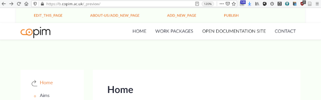
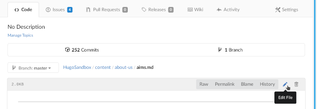
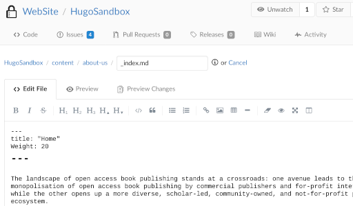
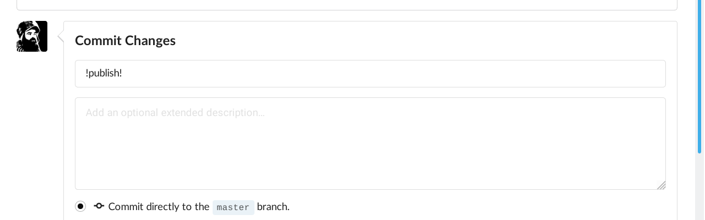

# COPIM's HugoSandbox

Our website is rendered/processed into a static HTML web site by [HUGO](https://gohugo.io/) using the *Markdown files* from this [Git](https://git-scm.com/) repository served to you by [Gitea](https://gitea.io/). *Markdown files* which are rendered into web site pages could be found inside the folder 📁 **content** which is listed right below 📁 **archetypes**, and above 📁 **i18n**, 📁 **public** etc. *Markdown files* have extension **.md**. We **add/edit** *Markdown files* in this repository in order to have **HUGO** process/render/convert it into the regular Web Site people can access. Through that process every *Markdown file* gets transformed into an individual Web/HTML Page.

#### There are two ways to edit existing Markdown files and add a new ones:

#### 1. One could edit the web site by custom setup at https://b.copim.ac.uk/_preview/ which adds the user friendly header which looks like this:

1. To **edit** the current page one should use the button/link **EDIT_THIS_PAGE**. It brings you straight into the editing *Markdown file* "responsible" for that web page.

2. To **add** a new *Markdown file* under the current folder one should use the button/link **FOLDER/ADD_NEW_PAGE** (where **FOLDER** would expand into either 📁 **about-us** or 📁 **work-pacakges** regarding current URL one is visiting at that moment)

3. To **add** a new *Markdown file* one should use the button/link **ADD_NEW_PAGE**. (If you want to add a new folder where that new *Markdown file* would sit start by typing the name of the new folder and add **/** (slash) after the name, the moment after you add **/** the input area will automatically let you continue with typing the name of the *Markdown file* to be added. Yet another thing which is easier if you just try it.)  

4. After you are done with editing/adding the *Markdown files* and satisfie with the changes you should click on the button/link **PUBLISH** which would bring you straight into the editing **PUBLISH.trigger.md** after which commit[^2] the web site will be published. The new changes will be visible to everyone visiting the web site.

####  2. One could also edit the web site by using this Gitea instance (https://a.copim.ac.uk/WebSite/HugoSandbox) where you just read this **README.md** file.

1. To **edit** *Markdown files* you should get inside the 📁 **content** folder where you will find two folders 📁 **about-us** and 📁 **work-packages**. All the individual *Markdown files* are saved/accessible there.

2. To **edit** a particular *Markdown file* in this repository you should click on the 🖉 (pen) in the top right corner of the Gitea toolbar which appears after you open the Gitea web page of that *Markdown file*

    - It is very important to always keep the **header**[^1] at the top of the *Markdown file*. You can recognize it as it has three dashes ( --- ) in its first line. It is then followed by **title** and/or **date** lines, sometimes **weights**, carrying the obvious value of the **title**, **date** or **weight** of that *Markdown file*. The **weight** value is used by the web site **menus** so the *Markdown file's* corresponding web page with lower number will apear above the one with higher number. Usually you make the top of the **menu** with **weight: 10** and the rest with 20, 30, 40... So if you ever go back and add the new *Markdown file* to the repository you could easily make its **weight** values somewhere in between *"the tens"* (e.g. 25, 35, 45..) without changing **weight** value of any the *"old"* ones. Here is one of the **headers** from 📁 **content/about-us/\_index.md**:  

3. To **add** a new *Markdown file* one should click the button **[New File]** in the folder where one wants the new *Markdown file* (at the moment these are 📁 **content/about-us** and 📁 **content/work-packages**)

    - Every **new** *Markdown file* should have **.md** extension as the part of its name. For example: **ResearchReport.md**.
    - Every **new** *Markdown file* has to have **header**[^1] at the top. The first line should start with three dashes ( **---** ), the second line should have a **title** (for example: **title: "Research Report 2021"**), if you want/need you should also add **weight** and/or **date** in the following lines but make sure that the **header** should end again with three dashes ( **--** ). After that last line with the three dashes you should add your actual content.

4. To **upload** images one should click the button **[Upload File]** and upload the image inside the folder 📁 **static/images**. Once inside the 📁 **static/images** there are bunch of already uploaded images. Important to note is that if you are uploading an image, make sure the file name doesn't contain spaces " " but instead has **underscores** or is made into the one-word. For example: *team_photo.jpg*, *teamphoto.jpg* or *TeamPhoto.jpg*.

5. To **PUBLISH** the web site with the all of the latest changes one should **edit** the file **PUBLISH.trigger.md**. It is listed in the root of this repository. Once there **PUBLISH.trigger.md** should have the 🖉 (pen) in the top right corner of the Gitea page toolbar just like every other page in the repository. Published version of the web site is here: https://b.copim.ac.uk/

6. After you get familiar with the workflow you migh also try the *trick* to *quickly* **PUBLISH** the web site by adding **!publish!** as a part of the commit message just like shown in this screenshot:

After you **PUBLISH** the web site by using the **!publish!** *trick* in the commit message you shouldn't go and **edit** **PUBLISH.trigger.md**. If you do that nothing would go wrong but you'll just trigger **HUGO** to do the processing once more.

#### NOTE: The "preview" web site at https://b.copim.ac.uk/_preview/ will show automatically all of the changes after every commit/change. The "preview" version of the web site is not supposed to be shown to the public. Once you are satisfied with the "preview" version of the latest changes you are ready to PUBLISH the changes to the "official" version of the web site. You could do that by adding !publish! to the commit message or find PUBLISH.trigger.md file, change it and commit the changes.

---

*If anything went wrong those two files could help few people not scared of reading logs :)*

- https://b.copim.ac.uk/last-commit-log.txt
- https://b.copim.ac.uk/_preview/last-commit-log.txt

[^1]: **Header** is called [Front Matter](https://gohugo.io/content-management/front-matter/) in HUGO's documentation.
[^2]: The phrase *commiting the changes* is coming from Git vocabulary and if this is your first time to hear about it, probably the closest well known equivalent would be to say *saving the file after it has been changed*. In our case here the file being *saved* to the Git repository will add its latest changes to the history log of all of the previous versions of that file, it will add the name of the account which made those changes and the date when that happened. By doing all of that any file in the Git repository is easily reverted to any of the versions from the past, the history of who did what is kept and the whole repository is ready to be distributed, shared, and synced with any of its "clones" on other different computers.